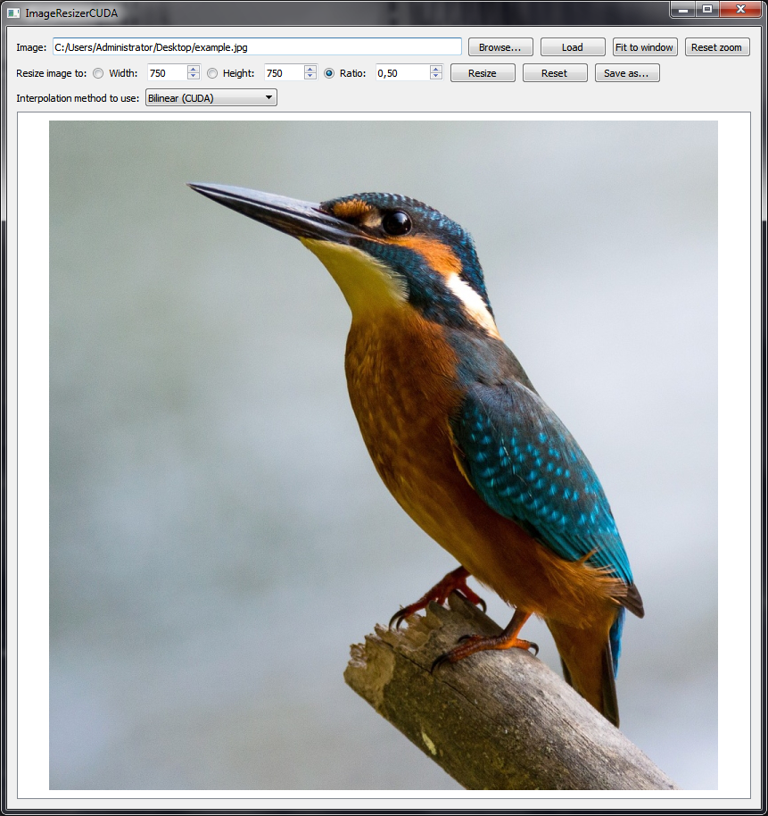
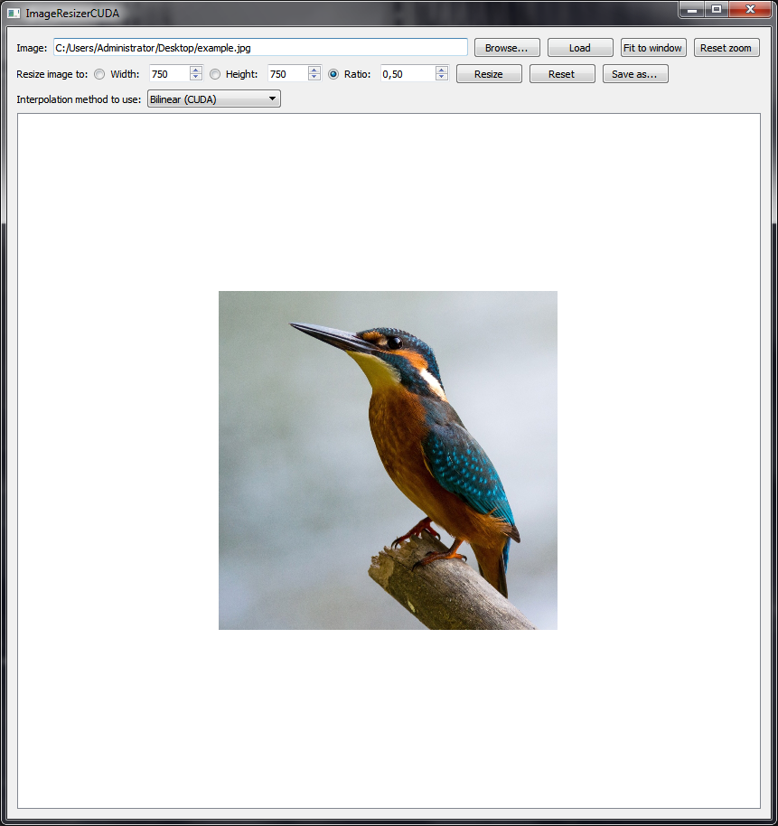

# ImageResizerCUDA
A NVidia CUDA implementation of the bilinear and nearest neighbor resizing algorithms. Written in Qt/C++.

## Download
Download link: [Win32 binary](https://github.com/Extender/ImageResizerCUDA/raw/master/bin/imageresizercuda-v1.0-bin-win32.zip)

## Screenshots

### Input

### Resized using bilinear interpolation (implemented in CUDA)

